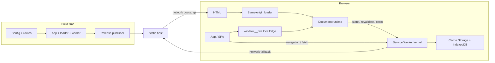

# Architecture

FWA Local Edge has three execution phases: build time, the document runtime, and the Service Worker kernel.



## Owners

| Owner | Responsibility |
| --- | --- |
| Build integration | Validate one config, inject the loader, build loader and worker entries, and publish one release closure |
| Document runtime | Derive same-origin paths, coordinate registration, expose current and available release state, and provide update and recovery actions |
| Service Worker kernel | Enforce request ownership, verify candidates, commit release metadata, serve pinned releases, and fail open to the network |
| Host application | Own business routes, APIs, UI, authentication, data authority, deployment policy, and the decision to enable Local Edge |

Source ownership is package-relative:

```text
src/
├── build/    Vite integration and release publisher
├── loader/   public facade, document runtime, and loader entry
├── worker/   kernel composition, release lifecycle, and storage
├── config-contract.ts
├── release.ts
└── route-policy.ts
```

The package has one outward seam for build integration and one for the document client. Loader and worker modules are package internals included for consumer-side bundling, not public deep-import APIs.

## Release model

The network entry remains independently runnable. A production build creates an app bundle, a same-origin loader, a Service Worker, and a schema-versioned release descriptor.

The worker installs a candidate into a release-scoped cache. It verifies each asset and rereads the complete cache before committing the active pointer in IndexedDB. Existing documents remain pinned to their loaded release; later documents select the newest complete active release.

This is release-level stale-while-revalidate. It is not per-request HTTP stale-while-revalidate and does not promise the newest release while offline.

## Dependency direction

Build code depends on pure config and path contracts. The document runtime depends on loader contracts and browser registration adapters. The worker depends on pure route policy, release contracts, and package-owned storage. Application code does not become a dependency of the package runtime.
